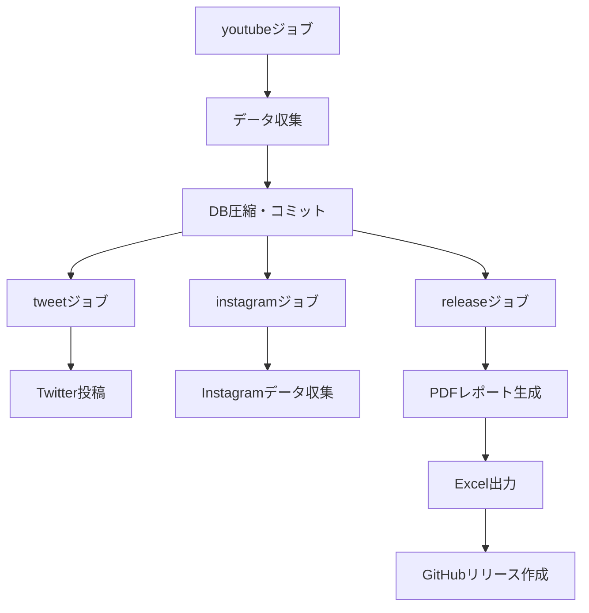

# アーキテクチャ概要

このドキュメントでは、youtube-viewcount-logger-rust のシステムアーキテクチャについて説明します。

## 1. システム概要

本システムは、YouTube の再生回数を定期的に収集し、可視化・レポート作成を行うアプリケーションです。

### 主要機能
- YouTube の動画再生回数を日次で収集
- YouTube データベースの構造化（楽曲情報の抽出）
- インスタグラムのフォロワー数等の収集
- Twitter への自動投稿
- PDF レポート・Excel 出力の生成

## 2. 技術スタック

### プログラミング言語
- **Rust**: メインアプリケーションおよびデータ収集処理
- **TypeScript**: レポート生成、可視化、Twitter 連携

### データベース
- **DuckDB**: 時系列データの保存と分析

### 外部 API
- YouTube Data API v3
- Gemini API（タイトル構造化）
- Twitter API

### デプロイメント
- GitHub Actions（日次ジョブ）

## 3. プロジェクト構造

```
.
├── src/
│   ├── lib.rs              # 共通ライブラリ（タイトル構造化、API クライアント）
│   ├── main.rs             # メイン: YouTube 再生回数収集
│   └── bin/
│       ├── excel_exporter.rs       # Excel 出力
│       ├── instagram_scraper.rs    # Instagram データ収集
│       ├── migrate_duckdb.rs       # SQLite → DuckDB マイグレーション
│       ├── migrate_db.rs           # レガシー DB マイグレーション
│       └── *.rs                    # その他のツール
├── render_graph.ts         # グラフ作成、Twitter 投稿
├── render_group_report.ts  # PDF レポート作成
├── assets/
│   ├── *.sql               # SQL クエリ
│   ├── *.typ               # Typst テンプレート
│   └── *.ttf               # フォント
└── .github/workflows/
    └── daily.yml           # CI/CD 設定
```

## 4. コアモジュール詳細

### 4.1 lib.rs - 共通ライブラリ

#### 主要機能
- **タイトルの構造化** (`struct_title`): Gemini API を使用して YouTube タイトルから楽曲名、アーティスト、バージョンなどを抽出
- **YouTube Data API クライアント** (`youtube_data_api_v3`): API エンドポイントへのラッパー
- **日付処理** (`get_desired_date`): スケジュール実行時の日付計算

#### 構造体
```rust
pub struct StructedSongTitle {
    pub song_name: String,    // 楽曲名
    pub singer: Vec<String>,  // 歌手
    pub edition: String,      // エディション情報
    pub version: String,      // バージョン情報
}
```

### 4.2 main.rs - 再生回数収集メイン処理

#### 処理フロー
1. **データベース初期化**: DuckDB へ接続
2. **プレイリスト取得**: `__source__`テーブルから監視対象リストを読み込み
3. **動画リスト構築**: 各プレイリストの動画 ID を収集
4. **動画情報取得**: YouTube API から再生回数・タイトル・公開日を取得
5. **タイトル構造化**: Gemini API を使用して楽曲情報を抽出・正規化
6. **データ保存**: 時系列データとしてデータベースに保存

#### 重要なデータ構造
- `VideoData`: 動画情報（ID、タイトル、再生回数、公開日）
- `lookup_table`: グループ別の動画リスト管理用ハッシュマップ

### 4.3 render_graph.ts - グラフ生成と Twitter 投稿

#### 機能
- **時系列グラフ作成**: ECharts を使用した再生回数推移グラフ
- **テーブル生成**: Typst を使用したランキングテーブル
- **Twitter 自動投稿**: グラフとテーブルを画像として投稿

#### 主要処理
1. データベースから各グループのデータを取得
2. ECharts で時系列グラフを生成（SVG→PNG 変換）
3. Typst でランキングテーブルを生成
4. Twitter API で画像付きツイートを投稿

### 4.4 render_group_report.ts - PDF レポート生成

#### 機能
- **グループ別レポート**: 各アーティスト/グループごとのPDFレポート作成
- **GitHub Releases 連携**: マークダウン形式のリリースノートも生成

#### 出力
- PDF ファイル（`workdir/group_report.pdf`）
- GitHub リリース用マークダウン（`workdir/github_release.md`）

### 4.5 excel_exporter.rs - Excel 出力

#### 機能
- **元データエクスポート**: ソース情報、タイトル情報、時系列データを Excel に出力
- **シート構成**:
  - `source`: プレイリスト元データ
  - `title`: 動画タイトル情報
  - 各グループ: 再生回数時系列データ

### 4.6 instagram_scraper.rs - Instagram データ収集

#### 機能
- **プロフィール情報収集**: フォロワー数、投稿数など
- **プロフィール画像保存**: SHA256 ハッシュで重複排除
- **データベース**: misc.duckdb に保存

## 5. データベース設計

### 5.1 data.duckdb（YouTube データ）

#### メタデータテーブル
- **`__source__`**: 監視対象プレイリスト情報
  - `playlist_key`: YouTube プレイリスト ID
  - `db_key`: データベース内テーブル名
  - `hashtag`: Twitter 投稿用ハッシュタグ
  - `screen_name`: 表示名
  - `is_tweet`: Twitter 投稿対象フラグ

- **`__title__`**: 動画タイトル情報
  - `youtube_id`: YouTube 動画 ID
  - `raw_title`: 元タイトル
  - `cleaned_title`: 正規化タイトル
  - `structured_title`: JSON 形式の構造化データ
  - `published_at`: 公開日時

#### 時系列データテーブル
- **各グループテーブル**: `index`（TIMESTAMPTZ 主キー）+ 各動画 ID をカラムとして持つ横持ち形式

### 5.2 misc.duckdb（Instagram データ）

- **`instagram_accounts`**: 監視対象アカウント
- **`instagram_stats`**: フォロワー数等の時系列データ
- **`instagram_profile_pics`**: プロフィール画像（BLOB）

## 6. CI/CD フロー

### GitHub Actions（.github/workflows/daily.yml）



### スケジュール
- 毎日 23:00 UTC（日本時間 08:00）に実行

## 7. ビルド設定

### Cargo.toml
```toml
[profile.relwithdebinfo]
inherits = "release"
debug = false
incremental = true
lto = true
opt-level = 2
```

- `relwithdebinfo` プロファイル: 最適化済みバイナリにデバッグ情報を付与

## 8. 環境変数

| 変数名 | 説明 |
|--------|------|
| `GOOGLE_API_KEY` | YouTube Data API 用 |
| `TWITTER_*` | Twitter API 認証情報 |
| `DEBUG` | デバッグモードフラグ |
| `TZ` | タイムゾーン（Asia/Tokyo） |

## 9. アセットファイル

### SQL クエリ
- `assets/graph_query.sql`: グラフ用データ取得
- `assets/tweet_query.sql`: Twitter 投稿用ランキング取得
- `assets/typst_table_query.sql`: テーブル表示用クエリ
- `assets/max_daily_viewcount.sql`: 日次最大再生回数

### Typst テンプレート
- `assets/template.typ`: PDF レポートのテンプレート

### フォント
- `assets/BIZUDPGothic-Regular.ttf`
- `assets/NotoSansJP-SemiBold.ttf`
- `assets/NotoColorEmoji-Regular.ttf`

## 10. 依存関係

### Rust
- `duckdb`: DuckDB ドライバー
- `tokio`: 非同期ランタイム
- `reqwest`: HTTP クライアント
- `serde_json`: JSON 処理
- `chrono`: 日時処理
- `rust_xlsxwriter`: Excel 出力

### TypeScript/Deno
- `@duckdb/node-api`: DuckDB クライアント
- `echarts`: グラフ描画
- `@napi-rs/canvas`: キャンバス描画
- `@resvg/resvg-js`: SVG から PNG 変換
- `typst`: ドキュメントコンパイラ
- `twitter-api-v2`: Twitter クライアント
